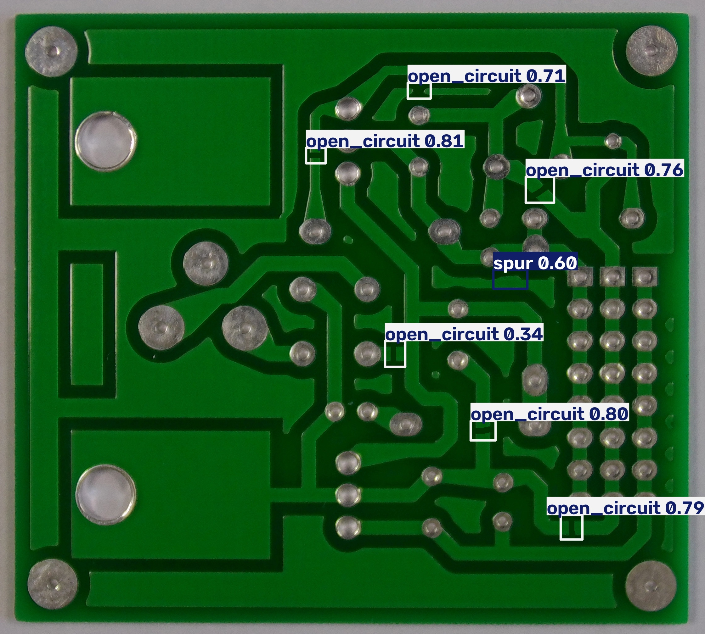
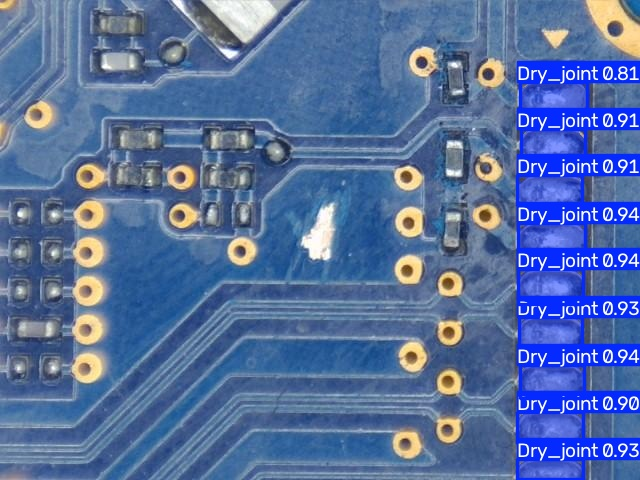

# PCB Defect Inspector

**Веб-сервис контроля качества печатных плат**: анализ фотографии с вердиктом
и живая камера с детекцией дефектов в реальном времени. Проект сделан командой
из трёх человек за 48 часов на хакатоне «Осенний Хакатон 2026» (задание 4).

| Анализ фото: разрыв дорожки | Живая камера: непропаянные элементы |
|---|---|
|  |  |

## Результаты

| Модель | Классы | mAP@0.5 | Precision | Роль |
|---|---|---|---|---|
| **Наша v2** — PKU + DsPCBSD+ (активная) | 10 | 0.927 | **0.978** | дорожки + «иные дефекты» из ТЗ |
| **Наша v1** — PKU | 6 | **0.944** | 0.924 | максимум на классах дорожек |
| YOLO26 (2025, чужая) | 6 | 0.839 | — | бенчмарк новейшей архитектуры |
| YOLOv8m · DsPCBSD+ (чужая) | 9 | 0.839 | — | бейзлайн |
| YOLOv8s · DeepPCB (чужая) | 6 | 0.985* | — | бейзлайн, домен вырезок |
| YOLOv8m-seg · keremberke (чужая) | 4 | 0.568 | — | компоненты: непропай 9/9, установка 10/10 |

\* метрика автора на лёгком домене; на нашей валидации — хуже наших моделей.

Ключевое о честности: **валидация — board-disjoint**, на платах, которых модель
не видела при обучении. Контр-пример, который мы поймали и задокументировали:
готовая YOLO26 показывала 0.995 на нашей выборке — по-платный анализ выявил,
что она обучалась на этих же платах (утечка); на её собственном честном тесте —
0.839. Воспроизводится: `python ml/bench_val.py`, разбор — `ml/bench_boards.py`.

Прочие цифры: инференс **11–44 мс** на RTX 3050, живой поток **45–50 FPS**
локально и ~8 FPS через интернет-ретранслятор; 43 автотеста; 6 моделей
в реестре с переключением на лету.

## Возможности

- **Анализ фотографии** — детекции, сводка, вердикт «годен / проверка / брак»
  и чек-лист покрытия пунктов ТЗ прямо в ответе API.
- **Живая камера** — маски дефектов в реальном времени; поток стабилизирован
  (подтверждение по кадрам, IoU-треки, EMA координат — рамки не мерцают).
- **Библиотека моделей** — 6 детекторов с switchable-реестром; у каждой свои
  `imgsz` и порог уверенности; алиасы классов приводят любые имена к каноническим.
- **Вкладка метрик** — сравнение всех моделей, включая наш бенчмарк YOLO26.
- **Демо-инфраструктура** — сервер на GPU-машине, доступ по HTTPS-туннелю
  (Tailscale), запасной канал на 443 порту, режим «видео-файл», предполётная
  проверка стенда.

## Как устроено

```
Браузер (фото / камера) → FastAPI → реестр моделей YOLO → вердикт-движок
                                          ↓                (годен/проверка/брак
                                    алиасы классов          + пункты ТЗ)
```

Один сервис держит REST API и статику фронтенда; инференс — в пуле потоков,
модели лениво загружаются и прогреваются на старте. Полностью: 
[docs/ARCHITECTURE.md](docs/ARCHITECTURE.md), API — [docs/API.md](docs/API.md)
и Swagger `/docs`.

## Быстрый старт

```bash
python -m venv .venv && .venv\Scripts\activate
pip install -r requirements.txt
uvicorn backend.app.main:app --port 8000        # → http://localhost:8000
```

Без ML-зависимостей сервер стартует в **режиме заглушки** (фейковые детекции) —
фронтенд и вердикты работают без весов. Для реальных моделей: положить веса в
`ml/weights/` (см. таблицу в `ml/README.md`), установить `ml/requirements-ml.txt`
и запустить с `USE_MOCK=false`. Демо-запуск с предполётной проверкой:
`run_demo.bat` (подробности — в [docs/VENUE_CHECKLIST.md](docs/VENUE_CHECKLIST.md)).

Тесты: `pip install -r requirements-dev.txt && python -m pytest` — 43 теста,
~2 секунды, ML не нужен.

## Обучение своей модели

```bash
python ml/merge_datasets.py                      # PKU + DsPCBSD+ → ml/data/merged
python ml/train_yolo.py --data ml/merged.yaml --model-size s \
       --epochs 60 --imgsz 640 --batch 16 --out pcb_merged_yolov8s.pt
python ml/bench_val.py                           # сверить метрики с metrics.json
```

Датасеты и весь ML-пайплайн — [ml/README.md](ml/README.md).

## Структура репозитория

```
backend/    FastAPI: реестр моделей, вердикты, сглаживание, чек-лист ТЗ, тесты
frontend/   одностраничный UI: фото, живая камера, метрики (без сборки)
ml/         датасеты, обучение, бенчмарки, HANDOFF, metrics.json
docs/       API, архитектура, план, чек-лист демо, сценарий выступления, Q&A
examples/   демо-фото (PKU val + keremberke, CC BY 4.0)
slides_build/  сборка презентации (pptxgenjs) + PCB_Defect_Inspector.pptx
```

## Данные и лицензии

- [PKU-Market-PCB-corrected](https://huggingface.co/datasets/KeenForgeAI/PKU-Market-PCB-corrected)
  (CC BY 4.0) и [DsPCBSD+](https://figshare.com/articles/dataset/DsPCBSD_/24970329)
  (CC BY 4.0) — датасеты обучения;
- [keremberke/pcb-defect-segmentation](https://huggingface.co/datasets/keremberke/pcb-defect-segmentation)
  (CC BY 4.0) — компонентные дефекты;
- Ultralytics YOLO — **AGPL-3.0**: для внутреннего использования ограничений нет,
  для SaaS — enterprise-лицензия Ultralytics либо модель с другой лицензией
  (пайплайн это позволяет: замена модели не трогает сервис).
- Код команды — использовать по согласованию с авторами.

## Команда

ML (датасеты, обучение, бенчмарки, стабилизация) — Никита ·
Backend (API, вердикты, тесты, инфраструктура демо) · Frontend (UI, поток камеры).

Полная история работы и решений — [docs/CHANGELOG.md](docs/CHANGELOG.md),
сценарий выступления и разбор вопросов жюри — [docs/PRESENTATION.md](docs/PRESENTATION.md),
[docs/JURY_QA.md](docs/JURY_QA.md).
